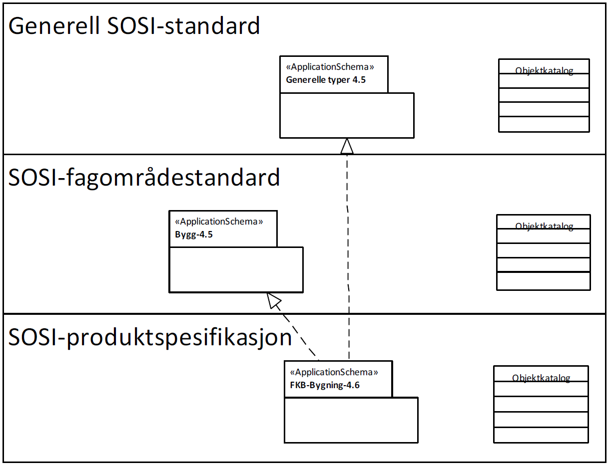
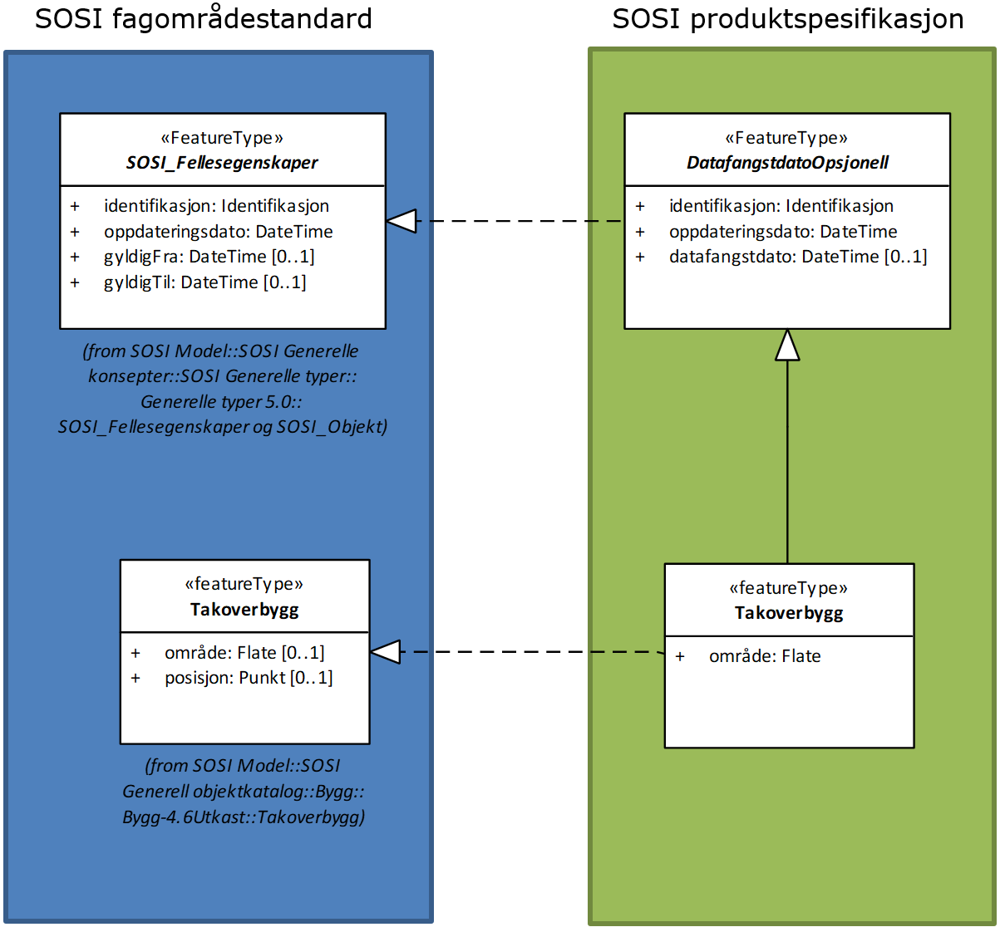

= Retningslinjer for forholdet mellom fagområdestandarder og produktspesifikasjoner, og deres objektkataloger
:encoding: utf-8
:lang: nb
include::Språk-{lang}.adoc[]
:toc: left
:toclevels: 4
:sectnums:
:sectnumlevels: 4
:numbered:
:!chapter-signifier: 
:!example-caption:
:!figure-caption:
:source-highlighter: rouge
:stem: latexmath
:eqnums:
:icons: font

Hva er en SOSI fagområdestandard og hva er en SOSI produktspesifikasjon, og hva er en SOSI objektkatalog. Begrepene i seg selv er veldefinerte, men allikevel har brukere og fagmiljøer til tider problemer med å bli enige om forholdet mellom dem. Dette dokumentet har som mål å presisere forskjellene og gi retningslinjer for hvordan man skal forholde seg til disse ulike konseptene.

.Figuren viser forholdet mellom modeller i ulike standardnivå og deres tilhørende objektaktalgoer

== Definisjoner
Under følger definisjonene av henholdsvis objektkatalog, produktspesifikasjon og fagområdestandard. Engelsk beskrivelse er i henhold til ISO-19000 serien, den norske er fritt oversatt.

.Feature catalogue
catalogue containing definitions and descriptions of the feature types, feature attributes and feature relationships occuring in one or more sets of geographic data, together with any feature operations that may be applied (ISO 19110)

.Objektkatalog
katalog som definerer og beskriver objekttyper med egenskaper, operasjoner og forhold objekttypene imellom, slik de framtrer i ett eller flere geografiske datasett

.Product specification
detailed description of a *dataset or dataset series* together with additional information about the dataset that will enable it to be created, supplied to and used by another party (ISO 19131)

NOTE A data product specification may be produced for production, sales, end-use or other purpose.

.Produktspesifikasjon
detaljert beskrivelse av ett datasett eller en serie med datasett med tilleggsinformasjon som gjør det mulig å produsere, distribuere og bruke datasettet av andre.

Merknad: En produktspesifikasjon kan lages for produksjon, salg, sluttbrukervirksomhet eller annet.

.Fagområdestandard
overordnet beskrivelse av et tematisk fagområde med en standardisert modell over alle kjente begreper innen området.

Merknad: En fagområdestandard skal beskrive den kjente virkeligheten og ikke ta hensyn til om det finnes tilgjengelige eller planlagte datasett med alt dette innholdet.

== Forholdet mellom SOSI fagområdestandard og SOSI produktspesifikasjon

.Figuren viser innsnevring av standarder i en produktspesifikasjon

=== SOSI fagområdestandard
En SOSI fagområdestandard utgjør en beskrivelse av selve fagområde, herunder en informasjonsmodell (UML applikasjonsskjema) som inneholder de modellelementer som fremkommer i arbeidet, som igjen er basert på alle mulige begreper som er fremkommet i arbeidet.

En SOSI fagområdestandard kan beskrive objekttyper og egenskaper som ikke nødvendigvis er tilgjengelige i dagens leveranser, men som det er identifisert kunnskap om og brukerkrav for.

SOSI fagområdestandarder inneholder begreper modellert i et UML applikasjonsskjema, og er utgangspunkt for en eller flere produktspesifikasjoner innen samme tema. SOSI fagområdestandarder sikrer interoperabilitet mellom produktspesifikasjoner innen samme tema, og utgjør et interoperabiltiets «layer» i infrastrukturen.

SOSI fagområdestandard er som navnet sier en standard, underlagt en konsensusprosess i en gruppe med åpen deltakelse fra dataeiere og fageksperter, og også fra verdiøkere og brukere. Dette arbeidet foregår på den måten at det lages et forslag standardiseringsprosjekt, med en konkret målsetting og ytterligere beskrivelse av hva standarden skal inneholde. Dette sendes standardiseringskomiteen for Geomatikk for godkjenning. Når forslaget til standardiseringsprosjekt er akseptert, sendes det ut invitasjon til SOSI referansegrupper og publiseres på Kartverket.no for åpen deltakelse i arbeidet.

=== SOSI produktspesifikasjon
En SOSI produktspesifikasjon er en spesifikasjon som oppfyller de krav som er beskrevet i standarden SOSI produktspesifikasjoner – Krav og godkjenning (SOSI del 1). 

En produktspesifikasjon er en detaljert beskrivelse av et datasett eller datasettserie som sammen med annen informasjon er utgangspunkt for å lage eller bruke dataene. Det er en presis teknisk beskrivelse av produktet i form av krav som produktet bør oppfylle. 

. En produktspesifikasjon kan lages for ulike formål: Utgangspunkt for en nærmere beskrivelse av produksjonsprosessen, både med tanke på ny datafangst, men også for produkter avledet fra allerede eksisterende data. 
. Beskrivelse av en produsents eksisterende data
. Utgangspunkt for brukerne vedrørende vurderingen av om dataene oppfyller de krav brukeren stiller. 

De fleste produktspesifikasjoner i dag lages med utgangspunkt i å spesifisere eksisterende data. Det viktigste eksempel på dette er det offentlige kartgrunnlaget (DOK) hvor sentrale dataeiere må beskrive eksisterende data i form av produktspesifikasjoner, som utgangspunkt for å gjøre data tilgjengelige. Dette er til sammenligning ikke ulikt det som INSPIRE (Geodataloven) har som formål, å gjøre eksisterende data tilgjengelig, men ikke noe krav om ny datafangst for å dekke nye brukerbehov.

=== SOSI standardisert produktspesifikasjon
En SOSI standardisert produktspesifikasjon er en spesifikasjon som i tillegg til å oppfylle kravene til SOSI produktspesifikasjon også er utviklet som en SOSI-standard, dvs. er underlagt en konsensusprosess i en gruppe med åpen deltakelse, og der prosjektforslag og ferdig spesifikasjon godkjennes av Standardiseringskomiteen for Geomatikk.

En SOSI standardisert produktspesifikasjon benyttes gjerne der man ønsker en standardiseringsprosess, men der nytten ved å beskrive fagområdet i en egen standard antas å være liten i forhold til kostnadene ved å utvikle en slik standard.  Dette kan f.eks. være dersom man antar produktspesifikasjonen vil være den eneste innenfor fagområdet, eller dersom spesifikasjonen i seg selv beskriver fagområdet godt nok til at nye spesifikasjoner kan utledes fra den.

=== En produktspesifikasjon kan gjerne brukes som et utkast til en standard, men da i en konsensusprosess og med åpen deltakelse
Objektkatalogen er en katalog som definerer og beskriver begreper, dvs objekttyper med egenskaper, operasjoner og assosiasjoner. Både SOSI fagområdestandarder og SOSI produktspesifikasjoner har en objektkatalog. Objektkatalogen er modellert i UML (UML applikasjonsskjema) og alle modellelementer dokumenteres i tillegg tekstlig. 

En fagområdestandards objektkatalog vil ha få påkrevde egenskaper, bare de egenskaper som anses nødvendig å ha med i alle produktspesifikasjoner innen samme tema. Eksempler på dette er egenskaper som er nødvendig for å identifisere objektet, slik som objekttypenavn og identifikasjon, egenskaper som realiserer lovpålegg, samt geometri.

== De viktigste forskjellene mellom SOSI fagområdestandard og SOSI produktspesifikasjoner
Som tidligere nevnt er en fagområdestandards objektkatalog langt mer «åpen» enn en produktspesifikasjons objektkatalog. Men det er også andre informasjonselementer (kapitler) i en produktspesifikasjon som ikke finnes i en fagområdestandard, slik som:

* Fellesegenskaper som identifikasjon, oppdateringsdato og liknende.
* Kvalitetskrav. En produktspesifikasjon inneholder ofte krav til kvalitet (stedfestingskvalitet, fullstendighet, osv.).
* Referansesystem. Angivelse av hvilke system som dataen foreligger i / er tenkt å foreligge i, er angitt ved en EPSG kode og tilsvarende SYSKODE.
* Datafangst. En produktspesifikasjon kan stille krav til hvordan data skal fremskaffes, f.eks. fotogrammetri, laser, terrengmåling, etc.) 
* Tilgjengeliggjøring. Hvilke grensesnitt og format vil produktet realiseres på (WFS, GML, SOSI syntaks, \+++). (En fagområdestandard vil ikke inneholde SOSI syntaks realisering eller GML applikasjonsskjema)
* Presentasjonsinformasjon. En fagområdestandard vil sjelden ha presentasjonsregler.
* Metadata. En produktspesifikasjon kan angi hvilke metadataelementer som skal registreres for et produkt. Dette gjelder alle metadataelementer ut over de som er pålagt i Geodataloven, disse skal alltid registreres.

== Regler for forholdet mellom en fagområdestandards- og produktspesifikasjons objektkatalog
Hovedregel er at SOSI produktspesifikasjoner skal innsnevre i forhold til SOSI fagområdestandarder:

* Påkrevde egenskaper og assosiasjoner i en SOSI fagområdestandard kan ikke gjøres opsjonelle ([1] -> [0..1] er ikke tillatt).
* Opsjonelle egenskaper og assosiasjoner, der det finnes data, bør gjøres påkrevd ([0..1] -> [1] eller [0..\*] -> [1] eller [1..*] er tillatt.)
* En produktspesifikasjon utgjør som regel en delmengde av det som er definert i en fagområdestandard.
* Geometrityper kan innsnevres. I en fagområdestandard er ofte geometri modellert som et kurvesegment (GM_Curve). GM_Curve kan i en produktspesifikasjon snevres inn til en eller noen få segmenttyper, slik som GM_Arc eller GM_LineString. Dette gjøres som en restriksjon til geometrien i en produktspesifikasjon.
* Definisjoner på begreper i SOSI fagområdestandard skal være så generelle at de kan inngå i ulike produkter, og kan ikke endres. En produktspesifikasjon kan imidlertid gi tilleggsdefinisjoner som avgrenser eller innsnevrer begrepet i en gitt kontekst. Et eksempel på dette er f.eks. angivelse av minsteareal på et vann for at det skal inngå i produktet. 
* En produktspesifikasjon kan snevre inn lovlige verdier i en kodeliste, enten denne er forvaltet i modellen eller eksternt. Dette gjøres som en constraint til den egenskapen som har kodelista som verditype. Endring av verdier i en ekstern forvaltet kodeliste gjøres av den etat som «eier» kodelista, dvs har forvaltningsansvar for kodelista. Utvidelse av koder i en kodeliste kan bare gjøres av den som er forvaltningsansvarlig
* En produktspesifikasjon kan introdusere nye begrep dersom disse ikke finnes i SOSI fagområdestandard. Da er det imidlertid viktig at disse meldes til standardiseringssekretariatet, enten direkte eller gjennom SOSI meldingsregister.
* En produktspesifikasjon kan ikke definere nye navn for begreper som allerede finnes i SOSI fagområdestandard. 
* En produktspesifikasjon kan ikke endre en egenskaps datatype slik denne fremkommer i SOSI fagområdestandard (Kan f.eks. ikke endre fra «CharacterString» til «Real»), men en tekstegenskap kan erstattes av ei kodeliste (subsett).
* En produktspesifikasjon er ikke bundet av fagområdeinndelingen i SOSI fagområdestandard, og kan bestå av begrep som er hentet fra flere fagområdestandarder (dvs å benytte begrep fra ulike tema). Da skal det henvises til de respektive fagområdestandarder i et pakkediagram.
* En produktspesifikasjon skal angi hvilke fellesegenskaper som skal inngå. Påkrevde fellesegenskaper skal alltid være med.